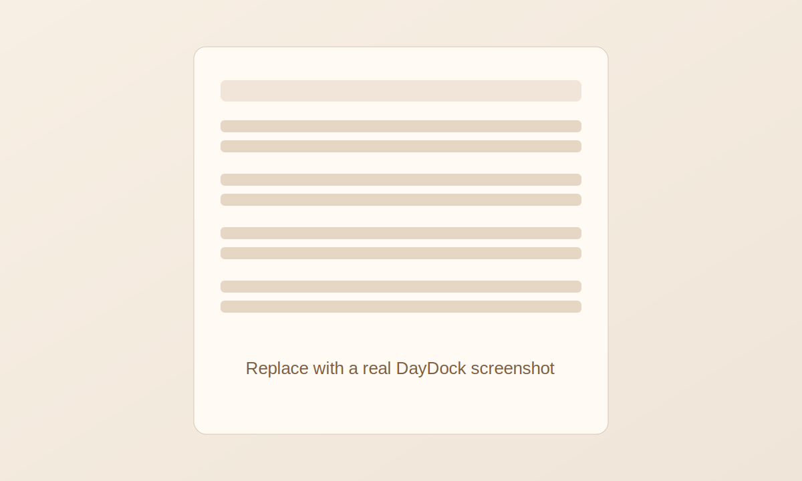

# DayDock

Floating macOS daily-note widget for markdown and Obsidian vaults.

DayDock reads a plain markdown daily note and renders:
- collapsible sections from headings,
- live task tracking with two-way editing,
- optional time-block-aware active task detection,
- Pomodoro + break reminders.

No workflow is hardcoded. Personal conventions are settings, not app logic.

## Screenshot



## Features

- Generic markdown rendering (supports Obsidian wikilinks and tags)
- Checkbox task toggling with write-back to the note file
- Inline task text editing
- Task time-block editing (`HH:MM - HH:MM → Task`)
- Active task prioritization by current time window, then first unchecked fallback
- Configurable section matcher for long-break suggestions (`ifTimeSectionPattern`)
- Pomodoro timer and configurable micro/long break reminders

## Requirements

- Node.js 20+
- pnpm 9+
- Rust toolchain (for Tauri builds)
- macOS (primary target)

## Quick Start

```bash
pnpm install
pnpm tauri dev
```

Then open settings in the app and set:
- `Vault folder`
- `Daily notes folder` (optional, defaults to `Daily Notes`)
- `Filename format` (defaults to `YYYY-MM-DD`)

## Daily Note Format

DayDock works with any markdown note. Section collapses come from headings:

```md
## Tasks
- [ ] 09:00 - 10:30 → Focus block
- [ ] Plain task without time
```

Time blocks are optional. If a valid time range is present, DayDock can use it for active-task selection.

## Settings Reference

- `ifTimeSectionPattern` (regex string, case-insensitive): picks which section feeds long-break task suggestions.
  - Default: `if time`
  - Example: `^(if time|later)$`
  - Invalid regex falls back safely to default.

## Sample Vault

See [`sample-vault/`](./sample-vault/) for a runnable example layout and daily note template.

## Development

```bash
pnpm dev
pnpm -s tsc --noEmit
pnpm -s test
pnpm -s build
```

## Open-Source Notes

- License: MIT (`LICENSE`)
- Contribution guide: `CONTRIBUTING.md`
- Security policy: `SECURITY.md`
- Code of Conduct: `CODE_OF_CONDUCT.md`

### Forking / Bundle Identifier

For app-store/distribution-safe forks, change the Tauri bundle identifier in:
- `src-tauri/tauri.conf.json` (`identifier`, currently `com.glen.daydock`)

Use a unique reverse-DNS ID such as `io.yourname.daydock`.
